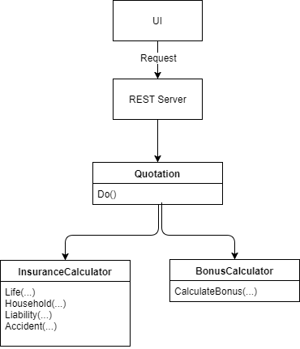

# Description

The web application can be used to request a quotation for up to 4 different types of insurances (life, household, liability, accident).
There is an UI for filling out a form with the needed data. All input fields for data that is not needed for the selected insurances (e.g. age if no life insurance is selected).
When submitting the form, a REST server is requested with the selected data. The server uses the business logic to calculate the price of all insurances and sends the quotation back to the UI where it is displayed to the user.

# Overview

# Details

## Input Data

* Personal Data
    * Age
    * Male (true/false)
    * Married (true/false)
    * Kids (0,1,2,...)

* Insurance types
    * Life
    * Household
    * Liability
    * Accident

## Price Specifications

### Life Insurance

* 100 base costs
* +50 if age >= 30
* +25 if male
* -25 if married && kids >= 2

### Household Insurance

* 75 base costs
* +50 if married

### Liability Insurance

* 250
* +50 if marrried
* +25 per kid

### Accident Insurance

* 100 base costs
* +25 if not male
* -25 if married

## Bonus

* -25 if at least 3 insurances and costs > 350
* additional -25 if 4 insurances and costs > 600